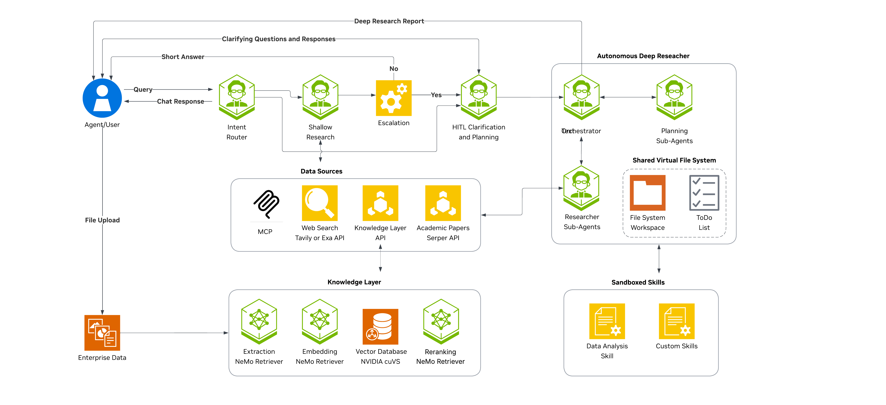

<!--
SPDX-FileCopyrightText: Copyright (c) 2025-2026, NVIDIA CORPORATION & AFFILIATES. All rights reserved.
SPDX-License-Identifier: Apache-2.0

Licensed under the Apache License, Version 2.0 (the "License");
you may not use this file except in compliance with the License.
You may obtain a copy of the License at

http://www.apache.org/licenses/LICENSE-2.0

Unless required by applicable law or agreed to in writing, software
distributed under the License is distributed on an "AS IS" BASIS,
WITHOUT WARRANTIES OR CONDITIONS OF ANY KIND, either express or implied.
See the License for the specific language governing permissions and
limitations under the License.

-->
<h1>NVIDIA AI-Q Blueprint</h1>

> **🏆 BENCHMARK NOTE 🏆**
>
> To obtain results consistent with the **nvidia-aiq** [DeepResearch Bench](https://huggingface.co/spaces/muset-ai/DeepResearch-Bench-Leaderboard) leaderboard and [DeepResearch Bench II](https://github.com/imlrz/DeepResearch-Bench-II) benchmark repository results, please use the [`drb1`](https://github.com/NVIDIA-AI-Blueprints/aiq/tree/drb1) and [`drb2`](https://github.com/NVIDIA-AI-Blueprints/aiq/tree/drb2) branches, respectively.


## Table of Contents
- [Overview](#overview)
- [What's New](#whats-new)
- [Software Components](#software-components)
- [Target Audience](#target-audience)
- [Prerequisites](#prerequisites)
- [Architecture](#architecture)
- [Getting Started](#getting-started)
  - [Clone the Repository](#clone-the-repository)
  - [Automated Setup](#automated-setup)
  - [Obtain API Keys](#obtain-api-keys)
  - [Set Up Environment Variables](#set-up-environment-variables)
- [Configuration Files](#configuration-files)
- [Ways to Run the Agents](#ways-to-run-the-agents)
  - [Command-line interface (CLI)](#command-line-interface-cli)
  - [Web UI](#web-ui)
  - [Async Deep Research Jobs](#async-deep-research-jobs)
  - [Benchmarks](#benchmarks)
  - [Jupyter Notebooks](#jupyter-notebooks)
- [Evaluating the Workflow](#evaluating-the-workflow)
  - [Available Benchmarks](#available-benchmarks)
  - [Running Evaluations](#running-evaluations)
- [Development](#development)
- [Roadmap](#roadmap)
- [Security Considerations](#security-considerations)
- [License](#license)

## Overview

The NVIDIA AI-Q Blueprint is an enterprise-grade research agent built on the [NVIDIA NeMo Agent Toolkit](https://docs.nvidia.com/nemo/agent-toolkit/latest/) and uses [LangChain Deep Agents](https://docs.langchain.com/oss/python/deepagents/overview). It gives you both **quick, cited answers** and **in-depth, report-style research** in one system, with benchmarks and evaluation harnesses so you can measure quality and improve over time.

<p align="center">

</p>

**Key features:**

- **Orchestration node** — One node classifies intent (meta vs. research), produces meta responses (for example, greetings, capabilities), and sets research depth (shallow vs. deep).
- **Shallow research** — Bounded, faster researcher with tool-calling and source citation.
- **Structured deep research** — Advisory source routing, structured planning, concurrent researcher workers, bounded source-tool batching, and a dedicated writer produce citation-backed reports and other requested output shapes.
- **Report follow-up** — Ask questions about a completed report, create a child-job cosmetic rewrite, or run delta research with the parent report as context.
- **Workflow configuration** — YAML configs define agents, tools, LLMs, and routing behavior so you can tune workflows without code changes.
- **Modular workflows** — All agents (orchestration node, shallow researcher, deep researcher, clarifier) are composable; each can run standalone or as part of the full pipeline.
- **Skills, sandbox execution, and durable outputs** — Built-in research/synthesis skills run code through a provider-neutral sandbox contract. Modal is fresh per job; the experimental OpenShell profile uses one shared, pre-provisioned sandbox and is not a multi-tenant isolation boundary. Opt-in rich-file capture checkpoints manifest-declared files after successful sandbox commands, finalizes on success/failure, stores bytes in SQL or S3-compatible storage, and delivers metadata to the Files tab live and on replay.
- **Portable Agent Skills** — `aiq-deploy` selects, starts, and validates an AI-Q deployment; `aiq-research` calls routed chat and async research from compatible coding harnesses.
- **Data source registry** — UI toggles and request payloads can select web, paper, enterprise, collaboration, and knowledge-layer sources per message.
- **Expanded sources** — Paper search supports Serper, SerpAPI, and SearchAPI; focused profiles demonstrate DuckDuckGo news, Polymarket, and OpenSearch knowledge retrieval.
- **Production API and auth** — REST endpoints, async job ownership, per-user OAuth-protected MCP sources, token validator entry points, and provider lifecycle hooks support authenticated deployments.
- **Opt-in policy controls** — NeMo Guardrails middleware covers selected workflow and agent boundaries, and narrow application-level encryption can protect final async output plus selected artifact-event content.
- **Observability, profiling, and cost analysis** — NAT-exported async traces preserve task, named-agent, and model/tool hierarchy across concurrent researchers. Tokenomics reports combine profiler traces with pricing configuration for cost, latency, and cache analysis.
- **Evaluation harnesses** — Built-in benchmarks (for example, FreshQA, DeepResearch) and evaluation scripts to measure quality and iterate on prompts and agent architecture.
- **Frontend options** — Run through CLI, web UI, or async jobs. Refer to [Getting started](#getting-started) and [Ways to run the agents](#ways-to-run-the-agents).
- **Deployment options** - Deployment assets for [Docker Compose](deploy/compose/) and [Helm](deploy/helm/deployment-k8s/); the repository source chart honors the Helm release namespace for every namespaced resource.

## What's New

Recent changes include:

- **Structured, concurrent deep research** — Advisory source routing, structured planning,
  concurrent researcher workers, bounded source-tool batching, and a dedicated writer replace
  the earlier three-role flow and move plan ownership out of the clarifier.
- **Work that continues from a completed report** — Users can ask questions against an existing
  report, create child-job rewrites, or run delta research with the parent report as context.
- **Portable skills, sandboxes, and durable files** — Provider-neutral sandbox execution,
  the new `aiq-deploy` skill, expanded `aiq-research` workflows, opt-in artifact capture, SQL or
  S3-compatible storage, and live or replayed Files-tab access turn generated files into durable
  outputs.
- **Enterprise data and policy controls** — OpenSearch joins the knowledge backends; per-user MCP
  OAuth, opt-in NeMo Guardrails middleware, and narrowly scoped async-content encryption add
  deployment controls without making them universal defaults.
- **Operations and user experience** — Async traces preserve the agent hierarchy, the source Helm
  chart honors the selected release namespace, and the UI improves concurrent-research activity,
  session recovery, and WebSocket reliability.

See the [changelog](CHANGELOG.md) for detailed release history; the linked feature docs describe
configuration and current limitations.


## Software Components

The checked-in default CLI and web profiles use these core components:

- [NVIDIA NeMo Agent Toolkit 1.8.0](https://docs.nvidia.com/nemo/agent-toolkit/latest/)
- [LangChain Deep Agents](https://docs.langchain.com/oss/python/deepagents/overview) 0.6.5 or newer
- [NVIDIA Nemotron 3 Super 120B A12B](https://build.nvidia.com/nvidia/nemotron-3-super-120b-a12b/modelcard) for intent, shallow research, source routing, and deep-research roles in the default profiles
- [NVIDIA nemotron-mini-4b-instruct](https://build.nvidia.com/nvidia/nemotron-mini-4b-instruct/modelcard) (document summary, if used)
- [NVIDIA llama-nemotron-embed-vl-1b-v2](https://build.nvidia.com/nvidia/llama-nemotron-embed-vl-1b-v2) (embedding model for llamaindex knowledge layer implementation, if used)
- [NVIDIA nemotron-nano-12b-v2-vl](https://build.nvidia.com/nvidia/nemotron-nano-12b-v2-vl) (vision-language model for llamaindex knowledge layer implementation, if used)
- [Tavily Search API](https://tavily.com/) for web search
- Serper, SerpAPI, or SearchAPI for Google Scholar paper search

Focused profiles can instead use [GPT-OSS-120B](https://build.nvidia.com/openai/gpt-oss-120b/modelcard)
for deep-research orchestration, planning, and writing, or GPT-5.2 for those roles in the
frontier-model example. Refer to [Configuration Files](#configuration-files); there is no single
all-features profile.

## Target Audience

This project is for:

- **AI researchers and developers**: People building or extending agentic research workflows
- **Enterprise teams**: Organizations needing tool-augmented research with citation-backed research
- **NeMo Agent Toolkit users**: Developers looking to understand advanced multi-agent patterns

## Prerequisites

- Python 3.11–3.13
- [uv](https://github.com/astral-sh/uv) package manager
- NVIDIA API key from [NVIDIA AI](https://build.nvidia.com) (for NIM models)
- Node.js 22+ and npm (optional, for web UI mode)


**Optional requirements:**
- Tavily API key (for web search functionality)
- A paper search API key for one of the supported providers: Serper (`SERPER_API_KEY`), SerpAPI (`SERPAPI_API_KEY`), or SearchAPI (`SEARCHAPI_API_KEY`)

> **Note:** Configure at least one data source (Tavily web search, Serper search tool, or knowledge layer) to enable research functionality.

If these optional API keys are not provided, the agent continues to operate without the corresponding search capabilities. Refer to [Obtain API Keys](#obtain-api-keys) for details.

## Hardware Requirements

When using [NVIDIA API Catalog](https://build.nvidia.com/) (the default), inference runs on NVIDIA-hosted infrastructure and there are no local GPU requirements. The hardware references below apply only when self-hosting models via [NVIDIA NIM](https://docs.nvidia.com/nim/).

| Component | Default Model | Self-Hosted Hardware Reference |
|-----------|---------------|-------------------------------|
| LLM (intent, shallow research, source routing, researcher) | `nvidia/nemotron-3-super-120b-a12b` | [Nemotron 3 Super model card](https://build.nvidia.com/nvidia/nemotron-3-super-120b-a12b/modelcard) |
| LLM (deep-research orchestrator, planner, writer) | `nvidia/nemotron-3-super-120b-a12b` in default profiles; GPT-OSS-120B or GPT-5.2 in focused profiles | [Configuration Files](#configuration-files) |
| Document summary (optional) | `nvidia/nemotron-mini-4b-instruct` | [Nemotron Mini 4B](https://build.nvidia.com/nvidia/nemotron-mini-4b-instruct/) |
| Text embedding | `nvidia/llama-nemotron-embed-vl-1b-v2` | [NeMo Retriever embedding support matrix](https://docs.nvidia.com/nim/nemo-retriever/text-embedding/latest/support-matrix.html) |
| VLM (image/chart extraction, optional) | `nvidia/nemotron-nano-12b-v2-vl` | [Vision language model support matrix](https://docs.nvidia.com/nim/vision-language-models/latest/support-matrix.html#nemotron-nano-12b-v2-vl) |
| Knowledge layer (Foundational RAG, optional) | -- | [RAG Blueprint support matrix](https://docs.nvidia.com/rag/latest/support-matrix.html) |

For detailed installation instructions, refer to [Installation -- Hardware Requirements](docs/source/get-started/installation.md#hardware-requirements).

## Architecture

AI-Q uses a [LangGraph](https://www.langchain.com/langgraph)-based state machine with the following key components:

- **Orchestration node**: Classifies intent (meta vs. research), produces meta responses when needed, and sets depth (shallow vs. deep) in one step
- **Shallow research agent**: Bounded tool-augmented research optimized for speed
- **Deep research agent**: Multi-phase research with planning, iteration, and citation management

Each agent can be run individually or as part of the orchestrated workflow. For detailed architecture documentation, refer to [Architecture](docs/source/architecture/overview.md).

## Getting Started

### Clone the Repository

```bash
git clone https://github.com/NVIDIA-AI-Blueprints/aiq.git && cd aiq
```

### Automated Setup

Run the setup script to initialize the environment:

```bash
./scripts/setup.sh
```

This script:
- Creates a Python virtual environment with uv
- Installs all Python dependencies (core, frontends, benchmarks, data sources)
- Installs UI dependencies (if Node.js is available)

### Manual Installation

For selective installation, install packages individually:

```bash
# Create and activate virtual environment
uv venv --python 3.13 .venv
source .venv/bin/activate

# Install core with development dependencies
uv pip install -e ".[dev]"

# Install frontends (pick what you need)
uv pip install -e ./frontends/cli          # CLI frontend
uv pip install -e ./frontends/debug        # Debug console
uv pip install -e ./frontends/aiq_api      # Unified API (includes debug)

# Install benchmarks (pick what you need)
uv pip install -e ./frontends/benchmarks/freshqa

# Install data sources (pick what you need)
uv pip install -e ./sources/tavily_web_search
uv pip install -e ./sources/google_scholar_paper_search
uv pip install -e "./sources/knowledge_layer[llamaindex,foundational_rag]"
```

### Obtain API Keys


| API        | Environment Variable | Purpose                   | Required                                                    |
| ---------- | -------------------- | ------------------------- | ----------------------------------------------------------- |
| NVIDIA API | `NVIDIA_API_KEY`     | LLM inference through NIM | Yes                                                         |
| Tavily     | `TAVILY_API_KEY`     | Web search                | No (if not specified, agent continues without web search)   |
| Serper     | `SERPER_API_KEY`     | Academic paper search     | No (if not specified, agent continues without paper search) |


#### Obtain an NVIDIA API Key

1. Sign in to [NVIDIA Build](https://build.nvidia.com/)
2. Click on any model, then select "Deploy" > "Get API Key" > "Generate Key"

#### Obtain a Tavily API Key

1. Sign in to [Tavily](https://tavily.com/)
2. Navigate to your dashboard
3. Generate an API key

#### Obtain a Paper Search API Key

Paper search supports three interchangeable providers. Set the `provider` field on the `paper_search` function in your workflow config (defaults to `serper`):

| Provider | Environment Variable | Sign-up |
|----------|----------------------|---------|
| Serper (default) | `SERPER_API_KEY` | [serper.dev](https://serper.dev/) |
| SerpAPI | `SERPAPI_API_KEY` | [serpapi.com](https://serpapi.com/) |
| SearchAPI | `SEARCHAPI_API_KEY` | [searchapi.io](https://www.searchapi.io/) |

Refer to [sources/google_scholar_paper_search/README.md](sources/google_scholar_paper_search/README.md) for configuration details.

### Set Up Environment Variables

Create a `.env` file in `deploy/` directory:

```bash
cp deploy/.env.example deploy/.env
```

Replace your API keys.

> **Note:** Depending on your usecase, deep research report quality can be enhanced by enabling searching across academic research papers. We use Serper for this. If you want to use paper search, follow the steps in the [Customization guide](docs/source/customization/tools-and-sources.md#disabling-a-tool) to enable it.

## Configuration Files

The `configs/` directory holds YAML workflow configs that define agents, tools, LLMs, and routing. Use the one that matches your run mode and data sources:

| Config | Models | Description |
|--------|--------|-------------|
| `config_cli_default.yml` | Nemotron 3 Super | CLI chat pipeline with Tavily and clarification; no knowledge backend. Paper search is a commented opt-in. |
| `config_web_default_llamaindex.yml` | Nemotron 3 Super; Nemotron Mini summary | Default web/API chat pipeline with LlamaIndex/ChromaDB and Tavily. Paper search is commented out. |
| `config_web_frag.yml` | Nemotron 3 Super | Web/API and Helm base with Foundational RAG plus Tavily. Requires separately deployed RAG query and ingestion services. |
| `config_web_opensearch.yml` | Nemotron 3 Super; NVIDIA embedding model | Web/API with built-in OpenSearch knowledge retrieval plus Tavily; supports self-hosted, `es`, and `aoss` authentication modes. |
| `config_frontier_models.yml` | GPT-5.2; Nemotron 3 Super; Nemotron Mini summary | LlamaIndex profile using GPT-5.2 for orchestration/planning/writing and Nemotron Super for routing/research. Requires `OPENAI_API_KEY`. |
| `config_web_default_guardrails.yml` | GPT-OSS-120B; Nemotron 3 Super; Nemotron Mini summary | LlamaIndex profile with workflow Guardrails attached and async deep-agent Guardrails selected; shallow middleware is defined but not attached. |
| `config_web_frag_mcp_auth.yml` | Nemotron 3 Super | Foundational RAG plus an opt-in protected per-user OAuth MCP source example. Requires a real MCP endpoint and shared token store. |
| `config_domain_routing_and_skills.yml` | Nemotron 3 Super; Nemotron Mini summary | Direct deep-research profile with domain routing, DuckDuckGo news, Polymarket, enabled Serper paper search, LlamaIndex, built-in skills, and a fresh per-job Modal sandbox. |
| `config_openshell.yml` | GPT-OSS-120B; Nemotron 3 Super; Nemotron Mini summary | Experimental web/API skills profile with artifact capture over one shared, pre-provisioned OpenShell sandbox; trusted single-operator use only. |

## Ways to Run the Agents

The `frontends/` directory contains different interfaces for interacting with the agents. You can also run agents directly through the NeMo Agent Toolkit CLI.

### Command-line interface (CLI)

The CLI provides an interactive research assistant in your terminal:

```bash
# Activate the virtual environment
source .venv/bin/activate

# Run with the convenience script
./scripts/start_cli.sh

# Verbose logging
./scripts/start_cli.sh --verbose

# Or run directly with the NeMo Agent Toolkit CLI (dotenv loads deploy/.env into the environment)
dotenv -f deploy/.env run nat run --config_file configs/config_cli_default.yml --input "How do I install CUDA?"
```

The CLI frontend source is in `frontends/cli/`.

### Web UI

For a full web-based experience:

```bash
./scripts/start_e2e.sh
```

This starts:
- Backend API server at `http://localhost:8000`
- Frontend UI at `http://localhost:3000`

The web UI source is in `frontends/ui/`. Refer to [frontends/ui/README.md](frontends/ui/README.md) for more details.

#### Web UI with Docker Compose

You can also run the backend and UI with Docker Compose:

```bash
cd deploy/compose

# No-auth local setup (LlamaIndex default)
docker compose --env-file ../.env -f docker-compose.yaml up -d --build

# To select a different backend config, set BACKEND_CONFIG in deploy/.env, for example:
# BACKEND_CONFIG=/app/configs/config_web_frag.yml
```

For more details, refer to:
- `deploy/compose/README.md`

### Async Deep Research Jobs

For public endpoints, SSE replay, report follow-up, and durable artifact access, refer to the
[REST API documentation](docs/source/integration/rest-api.md).

### Benchmarks

To run agents in evaluation mode, refer to the [Evaluating the Workflow](#evaluating-the-workflow) section.

### Jupyter Notebooks

The `docs/notebooks/` directory contains a three-part series that walks through the blueprint from first run to full customization. Run them in order:

| # | Notebook | What it covers | Prerequisites |
|---|----------|----------------|---------------|
| 0 | [Getting Started with AI-Q](docs/notebooks/0_Getting_Started_with_AIQ.ipynb) | Full blueprint overview — environment setup, orchestrated workflow (intent routing, shallow and deep research), and Docker Compose deployment | `NVIDIA_API_KEY`; optionally `TAVILY_API_KEY`, `SERPER_API_KEY` |
| 1 | [Deep Researcher — Web Search](docs/notebooks/1_Deep_Researcher_Web_Search.ipynb) | Deep researcher in depth — Python API, `nat run`, and end-to-end evaluation against the DeepResearch Bench with `nat eval` | Notebook 0 completed; `NVIDIA_API_KEY`, `TAVILY_API_KEY`, `SERPER_API_KEY`; OpenAI or Gemini key for the judge model |
| 2 | [Deep Researcher — Customization](docs/notebooks/2_Deep_Researcher_Customization.ipynb) | Extending the deep researcher — adding paper search, assigning different LLMs per agent role, editing prompts, and enabling the knowledge layer | Notebooks 0 and 1 completed; `NVIDIA_API_KEY`, `TAVILY_API_KEY`, `SERPER_API_KEY` |


## Evaluating the Workflow

The `frontends/benchmarks/` directory contains evaluation pipelines for assessing agent performance.

### Available Benchmarks

| Benchmark | Description | Location |
|-----------|-------------|----------|
| Deep Research Bench | RACE and FACT evaluation for research quality | `frontends/benchmarks/deepresearch_bench/` |
| FreshQA | Factuality evaluation on time-sensitive questions | `frontends/benchmarks/freshqa/` |

### Running Evaluations

### Step 1: Install the dataset

The dataset files are not included in the repository. We have included a script to retrieve them from the [Deep Research Bench Github Repository](https://github.com/Ayanami0730/deep_research_bench/tree/main) and format them for the NeMo Agent Toolkit evaluator.

To download the dataset files, run the following script:

```bash
python frontends/benchmarks/deepresearch_bench/scripts/download_drb_dataset.py
```

### Step 2: Generate reports using NAT evaluation harness

```bash
dotenv -f deploy/.env run nat eval --config_file frontends/benchmarks/deepresearch_bench/configs/config_deep_research_bench.yml
```

### Step 3: Convert the output into a compatible format
```bash
python frontends/benchmarks/deepresearch_bench/scripts/export_drb_jsonl.py --input <path to your workflow_output.json> --output <path to the output file you want to create with .jsonl extension>
```

### Step 4: Run evaluation
Follow instructions in the [Deep Research Bench Github Repository](https://github.com/Ayanami0730/deep_research_bench/tree/main) to run evaluation and obtain scores.


### Optional: Phoenix Tracing

If your config enables Phoenix tracing, start the Phoenix server before running `nat eval`.

Start server (separate terminal):

```bash
source .venv/bin/activate
phoenix serve
```

For detailed benchmark documentation, refer to:
- [Deep Research Bench README](frontends/benchmarks/deepresearch_bench/README.md)
- [FreshQA README](frontends/benchmarks/freshqa/README.md)

## Development

For development, contribution, and documentation, refer to:

- **[Development and Contributing](docs/source/contributing/index.md)**: Setup, testing, PR workflow, sign-off/DCO
- **[Tutorial Notebooks](docs/notebooks/)**: Getting started overview, deeper dive, and customization notebooks
- **[Architecture](docs/source/architecture/overview.md)**: Component details and data flow
- **[Customization](docs/source/customization/index.md)**: Configuration and customization options
- **[Knowledge Layer Setup](sources/knowledge_layer/KNOWLEDGE-LAYER-SETUP.md)**: RAG backends and document ingestion
- **[Agent Skills](docs/source/integration/agent-skills.md)**: Install the portable AI-Q research skill in compatible coding harnesses
- **[Skills and Sandbox Example](docs/source/examples/skills-sandbox/index.md)**: Run deep research with built-in skills and Modal sandbox execution
- **[Profiling and Cost Analysis](docs/source/profiling/index.md)**: Generate tokenomics and latency reports from NAT profiler traces
- **[Docs index](docs/README.md)**: Full documentation list and component docs
- **[Changelog](docs/source/resources/changelog.md)**: Version history and changes

## Roadmap

The checkboxes below track implementation in the current branch; a checked item does not by itself
indicate availability in a published release.

- [x] **[NeMo Guardrails](docs/source/customization/guardrails.md) Integration:** Opt-in middleware for selected workflow, shallow-researcher, and deep-researcher boundaries.
- [ ] **[NVIDIA Dynamo](https://github.com/ai-dynamo/dynamo) Integration:** Reduce latency via priority scheduling at scale.
- [x] **Per-user MCP OAuth:** Connect each signed-in user to protected MCP data sources through the UI.
- [x] **Skills & Sandboxing:** Support built-in deep-research skills through a provider-neutral contract. Modal is fresh per job; the experimental OpenShell profile is shared and not a multi-tenant isolation boundary.
- [x] **Report Follow-up and Rewriting:** Answer against a completed report, submit cosmetic child rewrites, and run delta research with parent-report context.
- [x] **Durable Sandbox Artifacts:** Opt-in manifest checkpoints after successful sandbox commands, terminal harvesting on success/failure, SQL or S3-compatible byte storage, and live/replayed Files-tab access.
- [ ] **Custom Skill Management:** Add UI and lifecycle controls for user-provided skill bundles.
- [ ] **Dynamic Model Routing:** Allow sub-agents to automatically select the optimal model per task.
- [ ] **Resource Management:** Implement configurable token caps and tool-call budgets.
- [ ] **Expanded Web Search:** Additional integration examples including Perplexity and You.com.
- [ ] **Multimedia Output:** Embed audio, video, and images directly into reports.
- [ ] **Voice-to-Text Input:** Integrate [NVIDIA Riva](https://developer.nvidia.com/riva) for hands-free accessibility.

## Security Considerations

- The AI-Q Blueprint is shared as a reference and is provided "as is". The security in the production environment is the responsibility of the end users deploying it. When deploying in a production environment, please have security experts review any potential risks and threats; define the trust boundaries, implement logging and monitoring capabilities, secure the communication channels, integrate AuthN & AuthZ with appropriate access controls, keep the deployment up to date, ensure the containers/source code are secure and free of known vulnerabilities.
- A robust frontend that handles AuthN & AuthZ is highly recommended. Missing AuthN & AuthZ will result in ungated access to customer models if directly exposed e.g. the internet, resulting in either cost to the customer, resource exhaustion, or denial of service.
- AI-Q includes opt-in [NeMo Guardrails middleware](docs/source/customization/guardrails.md) for selected workflow and agent boundaries. Guardrails are not enabled universally; operators must attach and test the policies required for their deployment.
- Optional [async job content encryption](docs/source/deployment/content-encryption.md) protects final job output and selected artifact-event content only. It is off by default and is not full database-level job-content encryption.
- The AI-Q Blueprint doesn't require any privileged access to the system.
- Deep research skills can invoke sandboxed code execution for analysis workflows. Keep sandbox credentials, quotas, lifecycle cleanup, and network policy aligned with your deployment's trust boundaries; do not use the shared OpenShell example as isolation between mutually untrusted jobs.
- End users are responsible for ensuring the availability of their deployment.
- End users are responsible for building, and patching, the container images to keep them up to date.
- The end users are responsible for ensuring that OSS packages used by the developer blueprint are current.
- The logs from middleware, backend, and demo app are printed to standard out. They can include input prompts and output completions for development purposes. The end users are advised to handle logging securely and avoid information leakage for production use cases.


## License

This project will download and install additional third-party open source software projects. Review the license terms of these open source projects before use, found in [LICENSE-THIRD-PARTY](LICENSE-THIRD-PARTY).

GOVERNING TERMS: AIQ blueprint software and materials are governed by the [Apache License, Version 2.0](https://www.apache.org/licenses/LICENSE-2.0)
