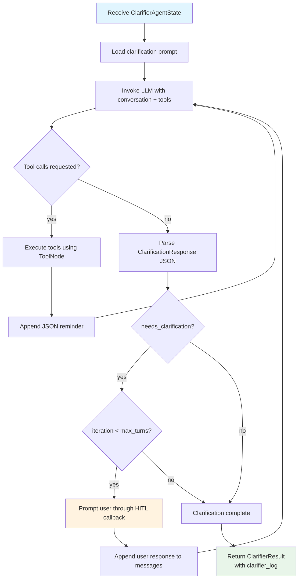

<!--
SPDX-FileCopyrightText: Copyright (c) 2025-2026, NVIDIA CORPORATION & AFFILIATES. All rights reserved.
SPDX-License-Identifier: Apache-2.0
-->

# Clarifier Agent

The Clarifier Agent provides human-in-the-loop (HITL) interaction before deep
research begins. It gathers context and, when the request is vague, optionally
asks the user to narrow the scope or clarify the type of output requested.

**Location:** `src/aiq_agent/agents/clarifier/agent.py`

## Purpose

Deep research is expensive in both time and compute. The Clarifier reduces
wasted effort by:

1. Gathering context (including optional tool calls such as web search) about the request
2. Asking focused clarification questions only when the request is genuinely ambiguous
3. Optionally clarifying the **type of output** the user wants (for example, report, table, comparison, prediction, or brief answer) when that is unclear

The clarifier runs on the deep research path and also when a shallow query
escalates to deep. It can be disabled entirely using `enable_clarifier: false`
in the orchestrator config.

## Internal Flow



## State Model

### ClarifierAgentState

| Field | Type | Default | Description |
| ----- | ---- | ------- | ----------- |
| `messages` | `Annotated[list[AnyMessage], add_messages]` | required | Conversation history with [LangGraph](https://docs.langchain.com/oss/python/langgraph/overview) message reducer |
| `data_sources` | `list[str]` or `None` | `None` | Data source IDs for tool filtering. `None` uses all configured tools; `[]` keeps only unmapped utility tools; a populated list scopes to the named sources plus unmapped utility tools. |
| `available_documents` | `list[dict[str, Any]]` or `None` | `None` | User-uploaded documents (file name, summary) for context; the user may refer to these |
| `max_turns` | `int` | `3` | Maximum clarification Q&A turns |
| `clarifier_log` | `str` | `""` | Accumulated clarification dialog log |
| `iteration` | `int` | `0` | Current clarification turn counter |

Computed property:
- `remaining_questions` = `max_turns - iteration`

### ClarifierResult

Returned to the orchestrator after the clarification dialog completes:

| Field | Type | Description |
| ----- | ---- | ----------- |
| `clarifier_log` | `str` | Full clarification dialog log |

### ClarificationResponse

Structured JSON response parsed from the LLM output during clarification:

| Field | Type | Description |
| ----- | ---- | ----------- |
| `needs_clarification` | `bool` | Whether more clarification is needed |
| `clarification_question` | `str` or `None` | The question to ask the user |

## Configuration

Configured through `ClarifierConfig` (NeMo Agent Toolkit type name: `clarifier_agent`):

| Parameter | Type | Default | Description |
| --------- | ---- | ------- | ----------- |
| `llm` | `LLMRef` | required | LLM for generating clarification questions |
| `tools` | `list[FunctionRef \| FunctionGroupRef]` | `[]` | Tools for context gathering (for example, web search) |
| `max_turns` | `int` | `3` | Maximum clarification Q&A turns before auto-completing |
| `log_response_max_chars` | `int` | `2000` | Maximum characters to log from LLM responses |
| `verbose` | `bool` | `false` | Enable verbose logging with `VerboseTraceCallback` |

**Example YAML:**

```yaml
functions:
  clarifier_agent:
    _type: clarifier_agent
    llm: nemotron_llm
    tools:
      - web_search_tool
    max_turns: 3
    verbose: true
```

## Prompt Templates

Located in `src/aiq_agent/agents/clarifier/prompts/`:

| Template | Purpose |
| -------- | ------- |
| `research_clarification.j2` | Generates clarification questions. Includes conditional sections for uploaded documents context. Instructs the LLM to respond with JSON containing `needs_clarification` and `clarification_question`. Template variables: `clarifier_result`, `available_documents`, `tools`, `tool_names` |

## HITL Interaction Patterns

The clarifier uses NeMo Agent Toolkit's `user_interaction_manager` to prompt the user.
The callback is injected during registration:

```
Agent:  "Could you clarify whether you're interested in renewable energy
         adoption in all G7 nations or specific ones?"
User:   "Focus on Germany and Japan."
Agent:  "Got it. Are you interested in economic impacts from a GDP perspective,
         job creation, or both?"
User:   "Both GDP impact and job creation."
Agent:  [clarification complete, proceeds to deep research]
```

When the desired output form is unclear, the clarifier may instead ask which
type of output you want (for example, a full report, a comparison table, or a
brief answer) before research begins.
