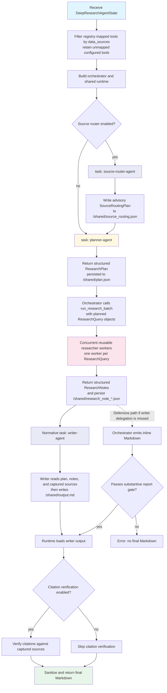
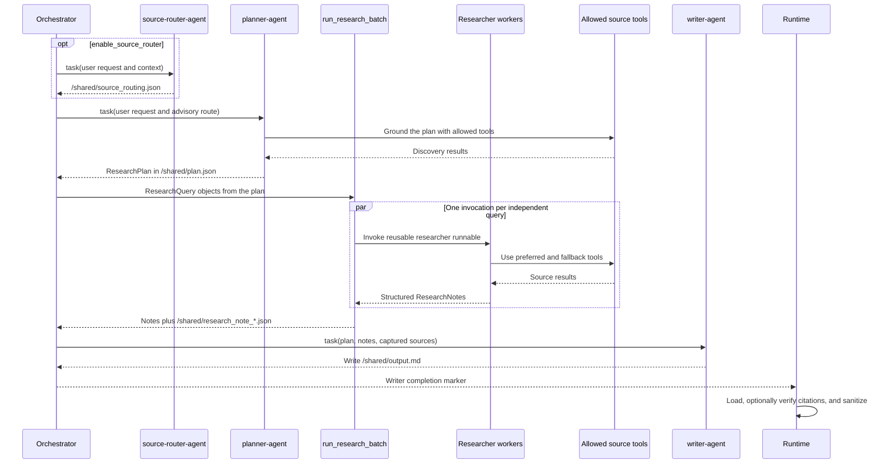

<!--
SPDX-FileCopyrightText: Copyright (c) 2025-2026, NVIDIA CORPORATION & AFFILIATES. All rights reserved.
SPDX-License-Identifier: Apache-2.0
-->

# Deep Researcher Agent

The Deep Researcher coordinates a structured research pipeline that separates
source routing, planning, evidence collection, and final synthesis. It uses
task subagents under an orchestrator plus reusable researcher workers created
with the [`deepagents`](https://docs.langchain.com/oss/python/deepagents/overview)
and [LangChain](https://docs.langchain.com/) libraries.

**Location:** `src/aiq_agent/agents/deep_researcher/agent.py`

For optional DeepAgents sandbox execution and operational notes, refer to
[Deep Research Sandbox](./sandbox.md).

## Purpose

The deep path handles queries that require comprehensive investigation:
multi-step research, comparative analyses, and topics that benefit from
structured planning and evidence gathered from multiple sources. It produces
the output shape requested by the user, including long-form reports, brief
answers, tables, comparisons, predictions, and data extractions.

## Internal Flow



### Coordination and Data Handoffs



The orchestrator serializes dependent stages and tracks progress. It does not
call source tools directly. The normative flow delegates final synthesis to
the writer; source access is delegated to the planner and researcher workers.
If the writer output file is missing, the runtime has a defensive fallback for
a substantive report emitted inline by the orchestrator.

## Runtime Roles

| Participant | Invocation | Responsibility and output |
| ----------- | ---------- | ------------------------- |
| Orchestrator | Root `create_deep_agent` graph | Coordinates stage order, reads the persisted plan, dispatches research batches, and normally delegates final synthesis. It has `run_research_batch` and helper tools, but no direct source tools. |
| `source-router-agent` | Optional DeepAgents `task()` subagent | Looks up the configured source catalog, chooses one advisory domain route, and writes a `SourceRoutingPlan` to `/shared/source_routing.json`. It does not research. |
| `planner-agent` | DeepAgents `task()` subagent | Grounds the requested answer strategy with available source tools and returns a structured `ResearchPlan`. The runtime persists it to `/shared/plan.json`. |
| Researcher workers | Reusable LangChain runnable invoked by `run_research_batch` | Each worker executes one self-contained `ResearchQuery` and returns structured `ResearchNotes`. Independent workers run concurrently up to the configured limit. |
| `writer-agent` | DeepAgents `task()` subagent | Reads the plan, research-note files, and captured sources; performs final-answer synthesis on the normative path; and writes `/shared/output.md`. It has no source-search tools and performs no new research. |

The source router, planner, and writer are task subagents registered with the
DeepAgents root graph. Researcher workers are different: they are invocations
of one reusable, structured-output runnable behind the orchestrator-only
`run_research_batch` tool. They do not appear as `task()` subagents and do
not manage top-level workflow todos.

## Data Source Boundary

`DeepResearchAgentState.data_sources` is a hard per-request boundary for
tools mapped in `data_source_registry`. The registration layer filters those
mapped tools before constructing the active deep-research agent. Configured
tools that are not mapped to a registry source remain active:

- `None` makes all configured tools available.
- `[]` removes mapped data-source tools while retaining unmapped configured
  tools, including utilities.
- A populated list admits only tools mapped to those source IDs, plus unmapped
  configured tools, including utilities.

The optional source router receives a catalog containing only mapped sources
within this boundary. Unmapped configured or utility tools do not appear in
that catalog even though they remain active. Router recommendations are
advisory and cannot restore a filtered-out mapped source.

The planner records exact available tool names in each
`ResearchQuery.preferred_tools` and `fallback_tools` as structured guidance.
Those fields do not narrow the callable tool set at runtime. Every researcher
worker is bound to the full request-filtered tool set and is prompted to try
the preferred and fallback tools in the recorded order.

## Middleware and Tool Boundaries

The roles use middleware appropriate to their contracts:

| Role | Relevant behavior |
| ---- | ----------------- |
| Orchestrator | DeepAgents task, todo, and filesystem support; source-routing guard; tool-name validation restricted to helpers and `run_research_batch`; tool and model retry handling |
| Source router | Minimal filesystem and retry middleware; catalog lookup and `write_file` only |
| Planner | Source capture, retries, filesystem access, todo suppression, structured `ResearchPlan` validation, and automatic plan persistence |
| Researcher worker | Filesystem context, optional skills, summarization, source capture, retries, and structured `ResearchNotes` validation |
| Writer | Filesystem context, optional synthesis skills, source-registry access, retries, and todo suppression; no source-search tools |

The root graph is constructed with `create_deep_agent`. The reusable
researcher runnable is constructed separately with `create_agent`, which is
what lets `run_research_batch` invoke independent queries concurrently.

## State Model

### DeepResearchAgentState

| Field | Type | Default | Description |
| ----- | ---- | ------- | ----------- |
| `messages` | `Annotated[list[AnyMessage], add_messages]` | required | Input query and conversation messages managed by the LangGraph message reducer |
| `data_sources` | `list[str]` or `None` | `None` | Hard per-request filter for registry-mapped source tools; unmapped configured tools remain active |
| `user_info` | `dict` or `None` | `None` | Authenticated user context available to prompts |
| `tools_info` | `list[dict]` or `None` | `None` | Available-tool metadata |
| `todos` | `list[dict]` | `[]` | Top-level progress list managed by the orchestrator |
| `files` | `dict` | `{}` | Merge-reduced virtual filesystem containing plans, notes, output, and optional parent-report context |
| `subagents` | `list[dict]` | `[]` | Status of configured DeepAgents task subagents; researcher worker invocations are not stored here |
| `rubric` | `str` or `None` | `None` | Optional DeepAgents rubric state |
| `clarifier_result` | `str` or `None` | `None` | Clarification log containing missing context or requested output-shape preferences gathered before research |
| `available_documents` | `list[AvailableDocument]` or `None` | `None` | User-uploaded documents and summaries available as research context |

When present, `clarifier_result` is injected as context. The planner
independently creates the `ResearchPlan` inside the deep-research workflow.

## Configuration

The architecture is configured through `DeepResearchAgentConfig` (NeMo Agent
Toolkit type name: `deep_research_agent`). The workflow-shaping parameters
are summarized here; refer to the
[Configuration Reference](../../customization/configuration-reference.md)
for configuration details.

| Parameter | Type | Default | Description |
| --------- | ---- | ------- | ----------- |
| `orchestrator_llm` | `LLMRef` | required | LLM for workflow coordination |
| `source_router_llm` | `LLMRef` or `None` | `None` | LLM for optional advisory routing; falls back to `orchestrator_llm` |
| `planner_llm` | `LLMRef` or `None` | `None` | LLM for structured planning; falls back to `orchestrator_llm` |
| `researcher_llm` | `LLMRef` or `None` | `None` | LLM used by every researcher worker; falls back to `orchestrator_llm` |
| `writer_llm` | `LLMRef` or `None` | `None` | LLM for final synthesis; falls back to `orchestrator_llm` |
| `tools` | `list[FunctionRef \| FunctionGroupRef]` | `[]` | Explicit source tools; an empty list inherits tools from the data-source registry |
| `exclude_tools` | `list[str]` | `[]` | Tool names removed from inherited tools |
| `domain_catalog_path` | `str` or `None` | `None` | Optional YAML or JSON domain catalog used by the source router |
| `enable_source_router` | `bool` | `true` | Run the advisory source-router stage before planning |
| `max_research_concurrency` | `int` | `6` | Maximum `ResearchQuery` items accepted and run concurrently per batch call |
| `skills` | `FunctionRef`, inline `deep_research_skills`, or `None` | `None` | Optional built-in skill assignments by agent name |
| `sandbox` | `FunctionRef`, inline `deep_research_sandbox`, or `None` | `None` | Optional sandbox profile for DeepAgents `execute` support |
| `enable_citation_verification` | `bool` | `true` | Verify generated citations against captured sources after final report extraction |
| `verbose` | `bool` | `true` | Enable detailed logging |

**Example YAML:**

```yaml
functions:
  deep_research_agent:
    _type: deep_research_agent
    orchestrator_llm: nemotron_llm
    source_router_llm: nemotron_super_llm
    planner_llm: nemotron_llm
    researcher_llm: nemotron_llm
    writer_llm: nemotron_super_llm
    enable_source_router: true
    enable_citation_verification: true
    max_research_concurrency: 6
    verbose: true
    tools:
      - web_search_tool
```

```{note}
**Nemotron Super — Build Endpoint Availability:** Nemotron Super (`nvidia/nemotron-3-super-120b-a12b`) is compatible and tested with AIQ, but Build API endpoints have limited availability due to high demand (HTTP 429/503 responses). The default configs use Nemotron Super for the `researcher_llm` role. For production deployments requiring consistent throughput, self-hosting via a [Brev Launchable](https://brev.nvidia.com/launchable/deploy?launchableID=nvidia-official-nemotron-super-49b-v1) is recommended. Refer to [Troubleshooting](../../resources/troubleshooting.md#nemotron-super--build-endpoint-availability) for details.
```

## Prompt Templates

Located in `src/aiq_agent/agents/deep_researcher/prompts/`:

| Template | Purpose |
| -------- | ------- |
| `orchestrator.j2` | Coordinates the ordered router, planner, batch-research, and writer handoffs |
| `source_router.j2` | Selects an advisory route from the allowed source catalog and writes `SourceRoutingPlan` |
| `planner.j2` | Builds the structured `ResearchPlan` and makes the final `ResearchQuery` tool choices |
| `researcher.j2` | Executes one `ResearchQuery` and returns structured `ResearchNotes` |
| `writer.j2` | Reads persisted artifacts and captured sources, then performs final synthesis into `/shared/output.md` |

## Workflow Phases

### Phase 1: Advisory Source Routing

When `enable_source_router` is true, `source-router-agent` selects one
domain route and source ordering from the already-allowed source catalog. It
writes `/shared/source_routing.json`. Planning continues without this stage
when it is disabled, and the route does not override the user's source
selection.

### Phase 2: Research Planning

The planner uses available source tools to ground a structured
`ResearchPlan` containing:

- Task analysis and the intended answer shape
- Required answer components and constraints
- Self-contained `ResearchQuery` objects
- Preferred and fallback tool guidance for each query

The planner reads source-routing guidance when available and records the final
query-level tool preference order. This is prompt guidance rather than runtime
tool enforcement. The runtime persists the validated plan to
`/shared/plan.json`.

### Phase 3: Concurrent Evidence Collection

The orchestrator passes the plan's independent `ResearchQuery` objects to
`run_research_batch`. The tool invokes one reusable researcher worker per
query concurrently, bounded by `max_research_concurrency`. Each worker:

1. Reads the relevant plan context
2. Is prompted to follow the query's preferred and fallback tool order while
   remaining bound to the full request-filtered tool set
3. Returns validated `ResearchNotes` with findings, sources, gaps, and an
   evidence judgment

The batch tool returns the notes to the orchestrator and persists them under
`/shared/research_note_*.json`. If only part of a batch fails, successful
notes remain registered and persisted; only failed or missing queries are
eligible for another call.

### Phase 4: Writer-First Final Synthesis

The orchestrator delegates once the plan and research notes are available.
The writer reads `/shared/plan.json`, all research-note files, and the
captured source registry. It may also read parent-report context for a report
edit. The writer performs no new research, writes the complete final answer to
`/shared/output.md`, and returns a short completion marker. The runtime loads
the Markdown from that file.

This is the normative synthesis contract. As a defensive compatibility path,
`_salvage_inline_report()` accepts the orchestrator's final message when the
output file is missing, but only if the message is substantive Markdown: at
least 400 characters with a Markdown heading and not merely the writer
completion marker. Otherwise, missing writer output remains an error.

### Phase 5: Citation Verification (Post-Processing)

Citation verification is enabled by default and configurable with
`enable_citation_verification`. When enabled, a deterministic
post-processing pipeline checks citations against sources captured from
configured tools. Report sanitization runs after final report extraction
regardless of this setting.

**Location:** `src/aiq_agent/common/citation_verification.py`

#### Source Registry

During planning and research, `SourceRegistryMiddleware` records URLs and
citation keys returned by allowed source tools in a per-session
`SourceRegistry`. Research-note source locators identify the compact set
carried forward for writer-facing citation selection.

#### Citation Verification

The `verify_citations()` function validates citations in the report against
the source registry using five URL matching strategies:

1. **Exact match** -- raw or normalized URL
2. **Truncation match** -- report URL is a prefix of exactly one registry URL
3. **Prefix match** -- normalized report URL is a prefix of a registry URL
4. **Child-path match** -- report URL path is a subpath of a registry URL
5. **Query-subset match** -- same host and path, with a subset of query parameters

Unmatched citations are removed and recorded with an audit reason. Knowledge
layer citations, such as `report.pdf, p.15`, are matched against citation
keys with lenient page-number comparison.

#### Report Sanitization

The `sanitize_report()` function removes potentially unsafe or unreliable
URLs from the report body:

- Shortened URLs
- Truncated or garbled URLs
- IP-address URLs
- Non-HTTP schemes such as `javascript:`, `data:`, `vbscript:`, and `file:`

After removals, citations are renumbered to close gaps in the reference list.

#### Verification Result

The verification result includes:

| Field | Description |
| ----- | ----------- |
| `verified_report` | Report text after citation verification |
| `removed_citations` | Removed citations with reasons |
| `valid_citations` | Retained citations with reference numbers |

## Evaluation

The Deep Researcher is evaluated using the Deep Research Bench (DRB), which
measures research reports using RACE and FACT metrics. Refer to
[Deep Research Bench](../../evaluation/benchmarks/deep-research-bench.md)
for full documentation.
