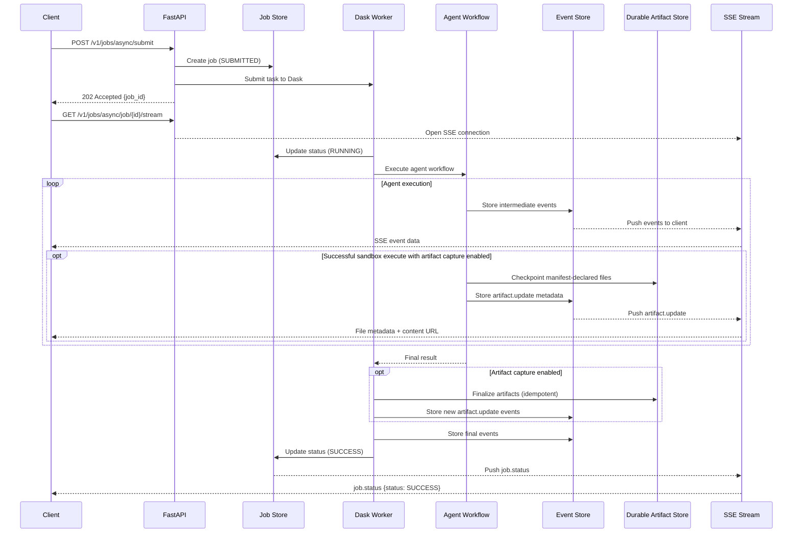
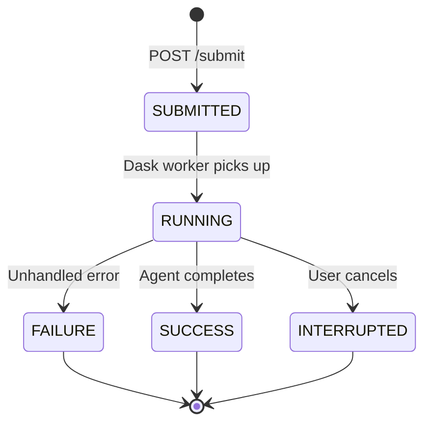
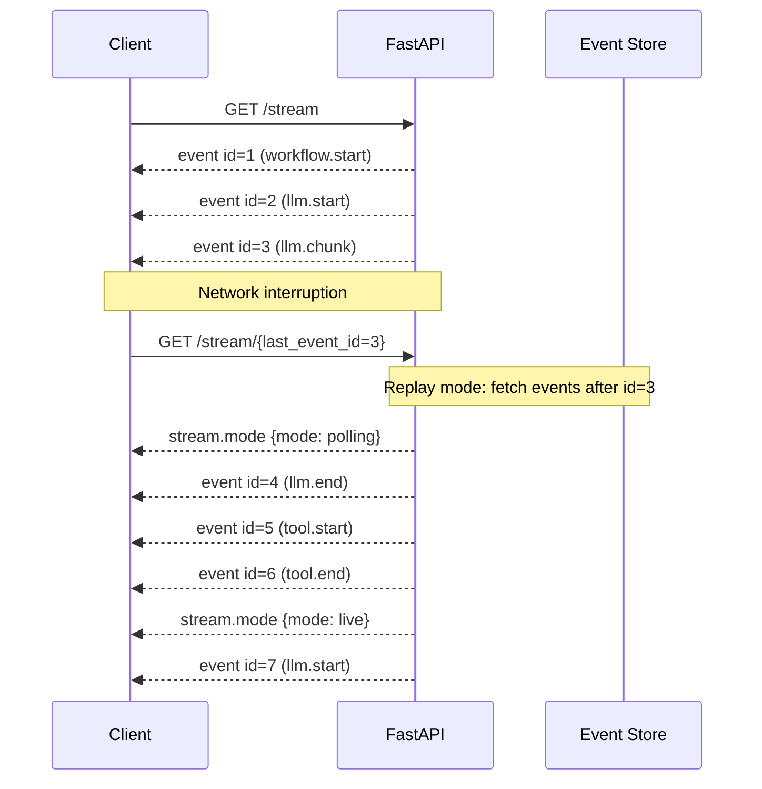

<!--
SPDX-FileCopyrightText: Copyright (c) 2025-2026, NVIDIA CORPORATION & AFFILIATES. All rights reserved.
SPDX-License-Identifier: Apache-2.0
-->

# Data Flow

This document describes the request lifecycle from client submission through
agent execution to response delivery, including async job management and
real-time SSE streaming.

## Request Lifecycle

Synchronous requests flow through the NeMo Agent Toolkit [FastAPI](https://fastapi.tiangolo.com/) frontend directly to the
agent workflow. Asynchronous requests (deep research) use a [Dask](https://www.dask.org/) cluster for
distributed execution with SSE-based progress streaming.



Artifact checkpoints run after successful sandbox `execute` calls. On a terminal
success or failure path, the worker performs one idempotent manifest-plus-directory
scan before sandbox cleanup. Cancellation performs that scan only when the provider
operation lease is immediately available; otherwise the provider is terminated without
waiting and artifacts from earlier checkpoints remain durable.

## Async Job States

Jobs progress through the following states:



| State | Description |
| ----- | ----------- |
| `SUBMITTED` | Job created and queued for execution |
| `RUNNING` | Dask worker is actively executing the agent |
| `SUCCESS` | Agent completed successfully; final report available |
| `FAILURE` | Agent encountered an unhandled error |
| `INTERRUPTED` | User requested cancellation using `POST /cancel` |

A background reaper task periodically marks stale `RUNNING` jobs as `FAILURE`
if they exceed the configured timeout, protecting against ghost jobs from
crashed workers.

## SSE Event Types

Most lifecycle events use a `category.state` naming convention aligned with NeMo Agent Toolkit's
`IntermediateStep` structure. The `AgentEventCallback` (a [LangChain](https://docs.langchain.com/) callback
handler) translates LangChain lifecycle events into this shape. Durable file captures also use
`artifact.update`; rejected candidates use the separate top-level `artifact.warning` event.

| Event Type | Category | State | Description |
| ---------- | -------- | ----- | ----------- |
| `stream.mode` | -- | -- | Announces stream mode: `polling` (catching up), `live` (real-time), or `pubsub` (PostgreSQL LISTEN/NOTIFY) |
| `job.status` | `job` | -- | Job status change; includes `status`, optional `reconnected` flag |
| `workflow.start` | `workflow` | `start` | Agent workflow execution begins |
| `workflow.end` | `workflow` | `end` | Agent workflow execution completes |
| `llm.start` | `llm` | `start` | LLM invocation begins; includes model name and prompt/message count |
| `llm.chunk` | `llm` | `chunk` | Streaming token chunk from LLM |
| `llm.end` | `llm` | `end` | LLM invocation completes; includes usage metadata and optional thinking/reasoning |
| `tool.start` | `tool` | `start` | Tool execution begins; includes tool name and input |
| `tool.end` | `tool` | `end` | Tool execution completes; may emit `citation_source` artifacts for search tools |
| `artifact.update` | `artifact` | `update` | File, citation, todo, or output update; durable files contain metadata and a content URL, never bytes |
| `artifact.warning` | -- | -- | Durable artifact candidate was rejected; includes its path and the rejection reason |
| `job.update` | `job` | `update` | Retry notification when a chain (LLM call) fails and is retried |
| `job.error` | `job` | -- | Error during job execution |
| `job.heartbeat` | `job` | -- | Periodic heartbeat from Dask worker (every 30s); keeps SSE alive and aids ghost job detection |
| `job.cancelled` | `job` | -- | Job was cancelled by user (emitted from Dask worker on `CancelledError`) |
| `job.cancellation_requested` | `job` | -- | Cancellation has been requested for the job |
| `job.shutdown` | `job` | -- | Server is shutting down; client should reconnect |

### Event Structure

Lifecycle events produced by `AgentEventCallback` follow the `IntermediateStepEvent` schema:

```json
{
  "type": "tool.start",
  "id": "uuid-v4",
  "name": "tavily_web_search",
  "timestamp": "2026-02-16T10:30:00Z",
  "data": {
    "input": {"query": "renewable energy GDP impact"},
    "output": null
  },
  "metadata": {}
}
```

Captured durable files use the same `artifact.update` envelope as other file updates. Their
nested `data.type` is `file`, and the payload contains metadata rather than file bytes:

```json
{
  "type": "artifact.update",
  "name": "market-share.png",
  "data": {
    "type": "file",
    "url": "/v1/jobs/async/job/job-uuid/artifacts/artifact-uuid/content",
    "content_url": "/v1/jobs/async/job/job-uuid/artifacts/artifact-uuid/content",
    "file_path": "market-share.png",
    "artifact_id": "artifact-uuid",
    "job_id": "job-uuid",
    "kind": "image",
    "mime_type": "image/png",
    "size_bytes": 184320,
    "sha256": "0000000000000000000000000000000000000000000000000000000000000000",
    "title": "Market share",
    "caption": "Market share by vendor",
    "inline": true
  }
}
```

An `artifact.warning` payload instead contains `data.path` and `data.reason` for the rejected candidate.

### Event-Derived and Durable Artifacts

`artifact.update` events carry event-derived state used for live UI updates and replay. Their nested `data.type`
is one of the following values. The
`GET /v1/jobs/async/job/{job_id}/state` endpoint reconstructs tool calls, outputs, and citations from those stored
events.

| Artifact Type | Description |
| ------------- | ----------- |
| `file` | Legacy virtual-filesystem content or durable generated-file metadata with a job-scoped content URL |
| `output` | Intermediate output (draft section, summary) |
| `citation_source` | A source URL or reference discovered during research |
| `citation_use` | An inline citation placed in the report |
| `todo` | A research task tracked by `TodoListMiddleware` |

Durable sandbox artifacts are a separate persistence contract for generated files such as charts, CSVs,
notebooks, and documents. Capture is opt-in and best-effort. Successful `execute` calls checkpoint
manifest-declared files; success/failure terminal paths perform one final manifest-plus-directory scan, while a
busy cancellation skips that scan rather than waiting on the provider. The durable store, not the replayed event,
is authoritative for artifact records and bytes. Stored `artifact.update` events provide metadata-only live and
replayed delivery to clients, including the web UI Files tab. A rejected candidate instead emits top-level
`artifact.warning`. List authoritative metadata with `GET /v1/jobs/async/job/{job_id}/artifacts` and fetch content with
`GET /v1/jobs/async/job/{job_id}/artifacts/{artifact_id}/content`. Refer to the
[REST API](../integration/rest-api.md#durable-sandbox-artifacts) for the complete capture, authorization, retention,
and content-serving contract.

## Reconnection and Replay

The SSE stream supports seamless reconnection after network interruptions.
Every event stored in the `EventStore` has a monotonically increasing integer
ID. Clients track the last received event ID and reconnect using the resume
endpoint.



### Replay Behavior

1. **Polling mode**: On reconnection, the stream enters polling mode and fetches
   all events after the provided `last_event_id` in large batches (up to
   10,000 for completed jobs, 1,000 for running jobs) with no polling delay.

2. **Mode transition**: Once the polling batch is smaller than the fetch limit
   (indicating the tail has been reached), the stream emits
   `stream.mode {mode: live}` and switches to live polling.

3. **Reconnection flag**: The first `job.status` event after reconnection
   includes `reconnected: true` so clients can distinguish reconnection
   status updates from new status changes.

4. **Completed job replay**: If the job already finished before the client
   reconnects, the stream replays all stored events and immediately sends the
   terminal `job.status` event.

## Representative API Endpoints

These are the endpoints that drive the core lifecycle shown above. The [REST API](../integration/rest-api.md) is
the canonical, complete endpoint inventory, including report follow-up, final-report retrieval, durable artifacts,
data sources, health checks, and their error and authorization semantics.

| Method | Endpoint | Description |
| ------ | -------- | ----------- |
| `POST` | `/v1/jobs/async/submit` | Submit a new async job |
| `GET` | `/v1/jobs/async/job/{job_id}` | Get job status |
| `GET` | `/v1/jobs/async/job/{job_id}/stream` | SSE stream from beginning |
| `GET` | `/v1/jobs/async/job/{job_id}/stream/{last_event_id}` | SSE stream from event ID (reconnection) |
| `POST` | `/v1/jobs/async/job/{job_id}/cancel` | Cancel a running job |
| `GET` | `/v1/jobs/async/job/{job_id}/state` | Reconstruct event-derived tool calls, outputs, and citations |

## Cancellation

When a client sends `POST /cancel`:

1. The Job Store sets the job status to `INTERRUPTED`
2. A `CancellationMonitor` running on the Dask worker polls the Job Store
   at regular intervals (default 1 second)
3. When the monitor detects `INTERRUPTED`, it sets an `asyncio.Event` that
   the agent workflow can check for cooperative cancellation
4. The SSE stream sends a final `job.status {status: INTERRUPTED}` event

## Graceful Shutdown

The `SSEConnectionManager` tracks all active SSE connections. During server
shutdown:

1. `signal_shutdown()` sets a shared event flag
2. Active SSE generators check the flag during polling intervals
3. Each stream emits a `job.shutdown` event before closing
4. The connection manager waits for all streams to terminate
