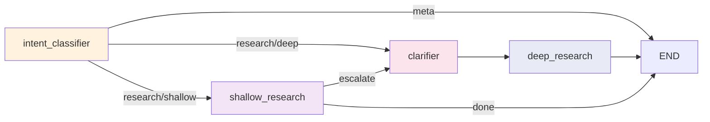

<!--
SPDX-FileCopyrightText: Copyright (c) 2025-2026, NVIDIA CORPORATION & AFFILIATES. All rights reserved.
SPDX-License-Identifier: Apache-2.0
-->

# Architecture Overview

The NVIDIA AI-Q Blueprint is a multi-agent research system built on the
[NVIDIA NeMo Agent Toolkit](https://docs.nvidia.com/nemo/agent-toolkit/latest/index.html).
It uses a two-tier research architecture that keeps simple queries fast while
reserving multi-phase deep research for complex topics.

## System Flow

The following diagram shows the full request lifecycle from user query to
final response. Every query enters through the Intent Classifier, which
decides whether to respond directly (meta), perform a quick tool-augmented
lookup (shallow), or initiate a comprehensive multi-agent investigation (deep).

```{image} /_static/AIQ-arch-light.png
:alt: AI-Q Architecture
:align: center
```

## Core Components

| Component | Role | Location |
| --------- | ---- | -------- |
| [Intent Classifier](agents/intent-classifier.md) | Single LLM call: classifies intent (meta/research) and depth (shallow/deep) | `agents/chat_researcher/nodes/intent_classifier.py` |
| [Clarifier Agent](agents/clarifier.md) | Optionally gathers missing context and the requested output type before deep research | `agents/clarifier/agent.py` |
| [Shallow Researcher](agents/shallow-researcher.md) | Fast, bounded tool-augmented research | `agents/shallow_researcher/agent.py` |
| [Deep Researcher](agents/deep-researcher.md) | Orchestrates optional source routing, structured planning, concurrent research workers, and writer-first synthesis | `agents/deep_researcher/agent.py` |
| Chat Researcher Orchestrator | [LangGraph](https://docs.langchain.com/oss/python/langgraph/overview) state machine coordinating all agents | `agents/chat_researcher/agent.py` |

## Orchestrator State Machine

The `ChatResearcherAgent` builds a LangGraph `StateGraph` over `ChatResearcherState` with
four nodes and conditional edges:



**Routing logic:**

1. **`route_after_orchestration`** -- After the intent classifier runs, the
   graph inspects `state.user_intent.intent`. If `meta`, the response is
   already in `state.messages` and the graph routes to `END`. If `research`,
   it checks `state.depth_decision.decision` to choose `shallow_research` or
   `clarifier`.

2. **`should_escalate`** -- After shallow research completes, the graph
   evaluates whether the response warrants escalation to deep research. It
   checks for empty responses and escalation keywords ("unable to find",
   "need more research", "i don't have enough information") in the last
   800 characters of the AI response. When escalation triggers, the graph
   routes to the `clarifier` node (not directly to `deep_research`), so it
   can gather any missing context or output-shape preference before research.
   Research planning then occurs inside the deep-research workflow.
   Escalation is gated by the `enable_escalation` config flag.

## ChatResearcherState

The central state model carries data through the entire workflow:

| Field | Type | Purpose |
| ----- | ---- | ------- |
| `messages` | `list[AnyMessage]` | Conversation history (LangGraph message reducer) |
| `user_info` | `dict` or `None` | Authenticated user information for personalization |
| `data_sources` | `list[str]` or `None` | Hard per-request filter for registry-mapped source tools. Unmapped configured or utility tools remain active. |
| `user_intent` | `IntentResult` or `None` | Classification result: `meta` or `research` |
| `depth_decision` | `DepthDecision` or `None` | Routing decision: `shallow` or `deep` |
| `final_report` | `str` or `None` | Final report output from deep research |
| `shallow_result` | `ShallowResult` or `None` | Result from shallow research path |
| `clarifier_result` | `str` or `None` | Clarification log containing missing context or output-shape preferences |
| `original_query` | `str` or `None` | Preserved user query for deep research |
| `available_documents` | `list[AvailableDocument]` or `None` | User-uploaded documents with summaries |

## Design Decisions

- **Two-tier routing**: Keeps common queries fast (single tool-calling loop)
  while reserving multi-stage deep research for complex cases. The intent
  classifier makes the routing decision in a single LLM call to minimize
  latency.

- **LangGraph state machine**: Provides explicit, testable routing with
  conversation checkpointing using `InMemorySaver` or persistent backends
  (SQLite, PostgreSQL).

- **Separated coordination and execution**: The deep-research orchestrator
  invokes optional source-router, planner, and writer task subagents. Research
  queries run through `run_research_batch` as concurrent invocations of a
  reusable researcher worker, not as `task()` subagents. The writer is the
  normative final-synthesis stage. If `/shared/output.md` is missing, the
  runtime can defensively accept a substantive orchestrator-authored Markdown
  report, but rejects short workflow chatter.

- **Toolkit-independent agents**: All agents receive dependencies through constructor
  injection for testability. NeMo Agent Toolkit registration is a thin layer in `register.py`
  files.

- **Data source filtering**: `data_sources` filters tools mapped in the data
  source registry before the active research agents are constructed. Unmapped
  configured tools remain active and are absent from the router catalog.
  Routing is advisory, and `ResearchQuery` preferred and fallback tool names
  are prompt guidance, while workers remain bound to the full request-filtered set.

- **Evaluation-driven defaults**: Routing and research budgets are tuned
  through benchmarks (FreshQA, Deep Research Bench) and can evolve as
  evaluation scores improve.

- **Citation verification and auditability**: Research paths capture sources
  for deterministic citation checks and URL sanitization. Deep-research
  citation verification is enabled by default and configurable with
  `enable_citation_verification`; it is not an unconditional workflow stage.
  Refer to
  [Deep Researcher -- Citation Verification](agents/deep-researcher.md#phase-5-citation-verification-post-processing)
  for details.

## References

- [Data Flow](data-flow.md) -- request lifecycle, SSE events, async jobs
- [NeMo Agent Toolkit documentation](https://docs.nvidia.com/nemo/agent-toolkit/latest/index.html)
- [Development and Contributing Guide](../contributing/index.md)
